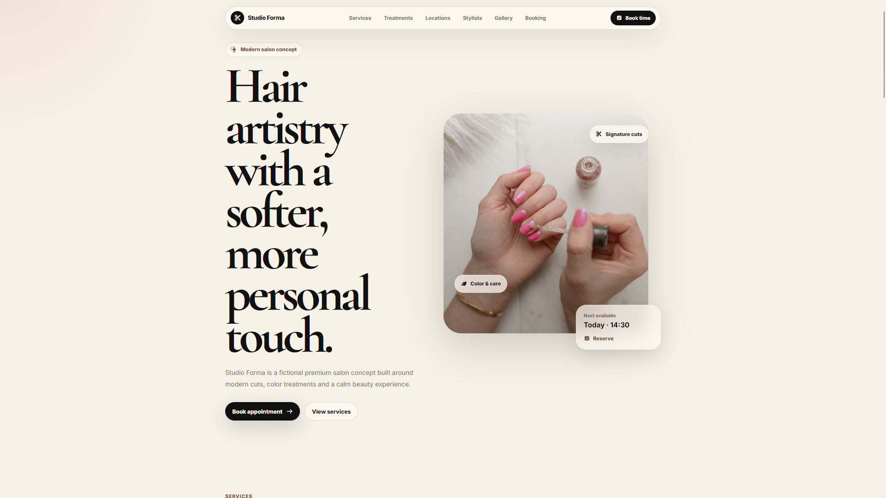
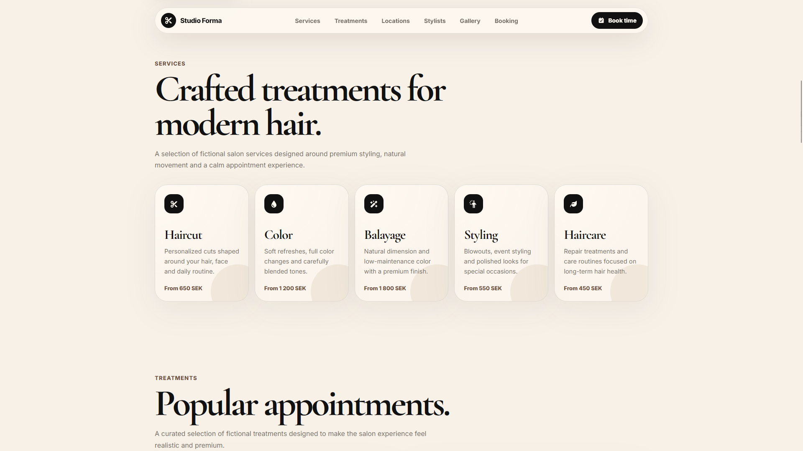
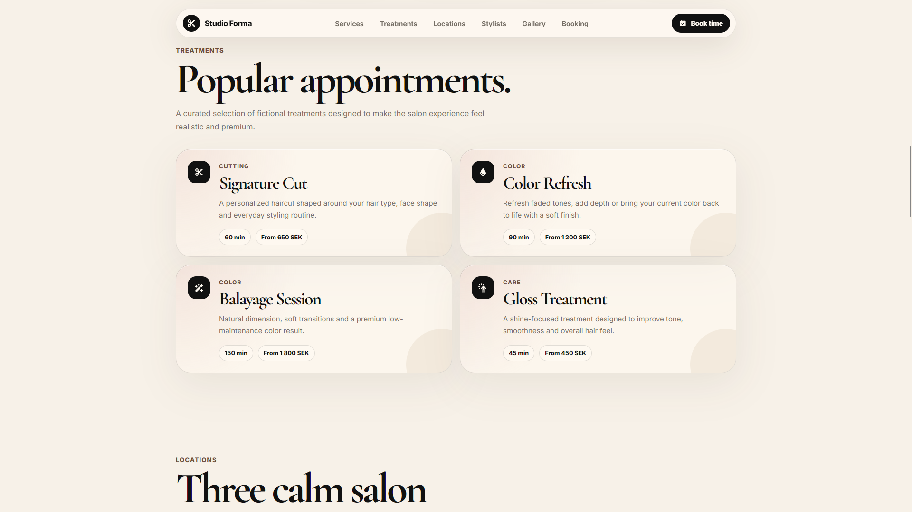
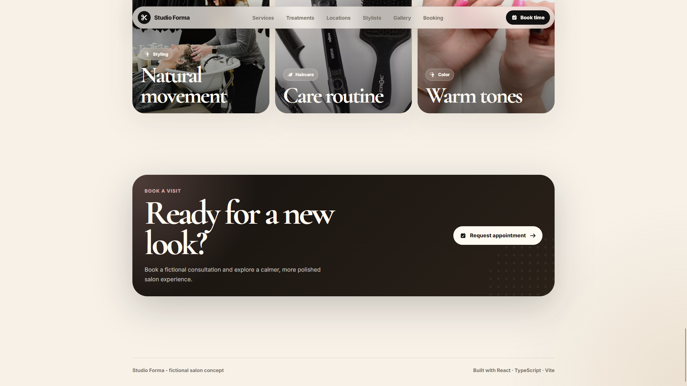
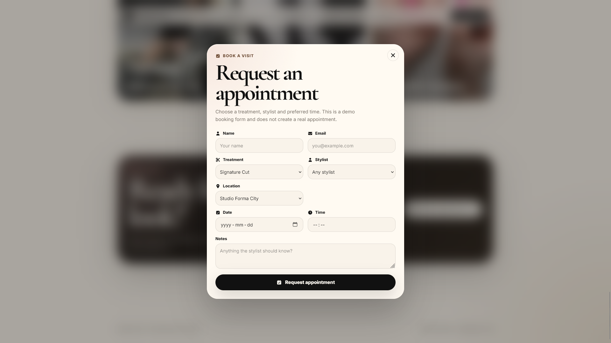

# Studio Forma

A premium fictional hair salon website concept built with **React**, **TypeScript** and **Vite**.

Studio Forma is a modern salon landing page created as a frontend portfolio project. The goal was to build a polished, responsive website that feels like it could belong to a real hair salon or beauty brand.

The design focuses on warm colors, editorial typography, large imagery, smooth layout sections and a calm premium feeling.



## Live Demo

[View Live Demo](YOUR_LIVE_DEMO_LINK_HERE)

## About the Project

Studio Forma was inspired by modern Swedish salon and beauty websites, but it is a completely fictional concept.

The site includes service sections, treatment cards, salon locations, stylist profiles, a gallery and a fake booking flow. It does not create real appointments, but the booking modal is built to feel like a realistic user interaction.

## Features

* Premium salon landing page
* Responsive desktop and mobile layout
* Sticky floating header
* Large editorial hero section
* Services section
* Treatment cards with prices and duration
* Fictional salon locations
* Stylist profile cards
* Lifestyle gallery grid
* Fake booking modal
* Booking request success state
* Smooth hover effects
* Warm beige, cream and dark visual style
* Portfolio-ready project structure

## Screenshots

### Hero


### Services



### Treatments



### Stylists



### Booking Modal



## Tech Stack

* React
* TypeScript
* Vite
* CSS
* Font Awesome
* Unsplash demo imagery

## Project Structure

```text
src/
├─ components/
│  ├─ BookingCTA/
│  ├─ BookingModal/
│  ├─ Footer/
│  ├─ Gallery/
│  ├─ Header/
│  ├─ Hero/
│  ├─ Locations/
│  ├─ SectionHeader/
│  ├─ Services/
│  ├─ Stylists/
│  └─ Treatments/
├─ data/
│  ├─ locations.ts
│  ├─ services.ts
│  ├─ stylists.ts
│  └─ treatments.ts
├─ App.css
├─ App.tsx
├─ index.css
└─ main.tsx
```

## Getting Started

Clone the repository:

```bash
git clone https://github.com/samme-commit/studio-forma.git
```

Navigate into the project:

```bash
cd studio-forma
```

Install dependencies:

```bash
npm install
```

Start the development server:

```bash
npm run dev
```

Build for production:

```bash
npm run build
```

Preview the production build:

```bash
npm run preview
```

## What I Practiced

While building Studio Forma, I focused on creating a website that feels more like a real client project than a small demo.

Some of the things I practiced were:

* Building reusable React components
* Structuring data in separate files
* Creating a premium visual direction with CSS
* Working with responsive layouts
* Designing cards, grids and modal interactions
* Creating a fake booking flow with React state
* Improving spacing, typography and visual hierarchy
* Presenting a small business website concept in a portfolio-friendly way

## Disclaimer

Studio Forma is a fictional hair salon website concept created for learning and portfolio purposes.

It is not affiliated with Headon or any other salon brand.
Images are used from Unsplash as demo imagery.

## Author

Built by **Samuel**.

* GitHub: [samme-commit](https://github.com/samme-commit)
